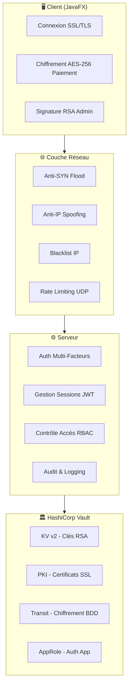
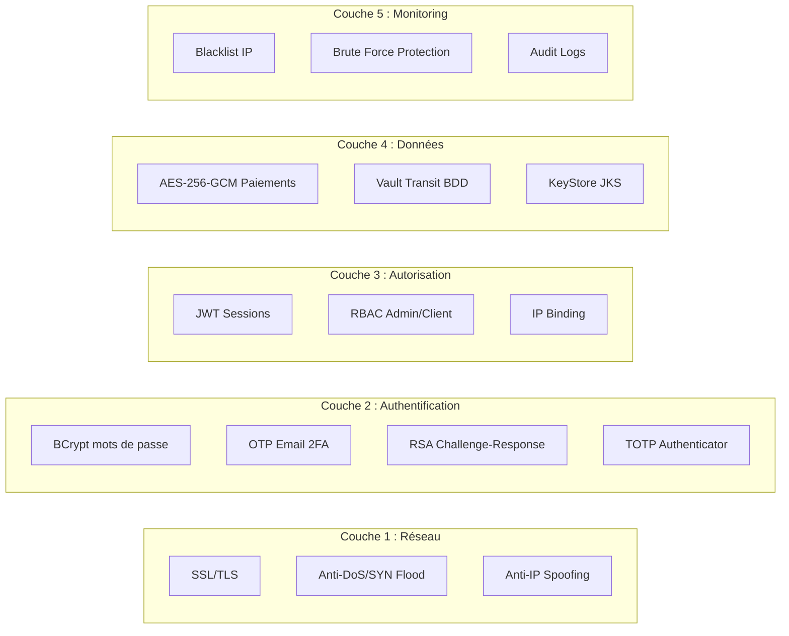

# 🔐 Architecture Sécurité Complète — ChriOnline

## Vue d'ensemble



---

## 1. 🏛️ HashiCorp Vault — Gestion Centralisée des Secrets

### Fichiers concernés
- [VaultServerService.java](file:///c:/Users/douae/Downloads/ChriOnline-Client-Server-App/src/main/java/com/chrionline/securite/VaultServerService.java)
- [VaultKeystoreService.java](file:///c:/Users/douae/Downloads/ChriOnline-Client-Server-App/src/main/java/com/chrionline/securite/VaultKeystoreService.java)
- [setup.sh](file:///c:/Users/douae/Downloads/ChriOnline-Client-Server-App/vault/setup.sh)
- [docker-compose.yml](file:///c:/Users/douae/Downloads/ChriOnline-Client-Server-App/docker-compose.yml)

### Authentification AppRole
L'application s'authentifie auprès de Vault via **AppRole** (pas de token statique) :
1. Le serveur Java envoie `VAULT_ROLE_ID` + `VAULT_SECRET_ID` à Vault
2. Vault retourne un **token temporaire** (TTL: 1h, max: 4h)
3. Ce token est utilisé pour accéder aux 3 moteurs ci-dessous

### Moteur KV v2 (`secret/`)
- **Stockage des clés publiques RSA** des administrateurs
- Chemin : `secret/admin/keys/{email}`
- Fallback : stockage en mémoire si Vault est indisponible

### Moteur PKI (`pki/`)
- **Certificats SSL dynamiques** générés automatiquement
- Root CA : `ChriOnline Root CA` (TTL: 10 ans)
- Certificats serveur : `localhost` (TTL: 72h, renouvelés automatiquement)
- Rotation automatique toutes les 12h via un scheduler

### Moteur Transit (`transit/`)
- **Chiffrement/Déchiffrement** des données sensibles avant stockage en BDD
- Clé : `chrionline-data` (AES-256-GCM côté Vault)
- Format chiffré : `vault:v1:xxxxx`

### Auto-Unseal
Si Vault est scellé (sealed) au démarrage, l'application le déverrouille automatiquement en lisant `vault/data/unseal_key.txt` et en appelant l'API `/sys/unseal`.

---

## 2. 🔒 SSL/TLS — Communication Chiffrée

### Fichiers concernés
- [Server.java](file:///c:/Users/douae/Downloads/ChriOnline-Client-Server-App/src/main/java/com/chrionline/server/core/Server.java) (côté serveur)
- [Client.java](file:///c:/Users/douae/Downloads/ChriOnline-Client-Server-App/src/main/java/com/chrionline/client/network/Client.java) (côté client)

### Architecture SSL
```
Client                          Serveur
  │                                │
  │── Connexion TLS ──────────────►│  Port 12345 (clients)
  │   (vérifie certificat via      │  Port 9445 (admins mTLS)
  │    Vault Root CA)              │
  │◄── Certificat PKI Vault ──────│
  │                                │
  │   Canal chiffré établi ✓       │
```

- **Port 12345** : SSL standard (tous les clients)
- **Port 9445** : **mTLS** (Mutual TLS) — le client admin doit aussi présenter un certificat
- Le certificat serveur est généré dynamiquement par Vault PKI
- Le client charge le Root CA depuis `vault/root_ca.crt` pour vérifier le serveur
- **Fallback** : si Vault est indisponible, utilise `keystore_test.jks`

---

## 3. 👤 Authentification Multi-Facteurs (MFA)

### Pour les Clients (2FA) — Email OTP
| Étape | Description | Fichier |
|-------|-------------|---------|
| 1 | Email + Mot de passe (BCrypt) | [UserDAO.java](file:///c:/Users/douae/Downloads/ChriOnline-Client-Server-App/src/main/java/com/chrionline/server/dao/UserDAO.java) |
| 2 | Code OTP 6 chiffres par email (5 min) | [EmailService.java](file:///c:/Users/douae/Downloads/ChriOnline-Client-Server-App/src/main/java/com/chrionline/server/service/EmailService.java) |

### Pour les Admins (3FA) — RSA + TOTP
| Étape | Description | Fichier |
|-------|-------------|---------|
| 1 | **Challenge RSA** : le serveur envoie un défi aléatoire | [ChallengeGenerator.java](file:///c:/Users/douae/Downloads/ChriOnline-Client-Server-App/src/main/java/com/chrionline/securite/ChallengeGenerator.java) |
| 2 | **Signature RSA** : l'admin signe avec sa clé privée locale (`admin.jks`) | [Signer.java](file:///c:/Users/douae/Downloads/ChriOnline-Client-Server-App/src/main/java/com/chrionline/securite/Signer.java) + [Verifier.java](file:///c:/Users/douae/Downloads/ChriOnline-Client-Server-App/src/main/java/com/chrionline/securite/Verifier.java) |
| 3 | **Code TOTP** (Microsoft Authenticator, 30s) | [TOTPService.java](file:///c:/Users/douae/Downloads/ChriOnline-Client-Server-App/src/main/java/com/chrionline/securite/TOTPService.java) |

### Flux Admin détaillé
```
Admin                        Serveur                      Vault
  │                             │                            │
  │── email ───────────────────►│                            │
  │◄── challenge aléatoire ─────│  (stocké 30s max)          │
  │                             │                            │
  │── signature(challenge) ────►│── getPublicKey(email) ────►│
  │                             │◄── clé publique RSA ───────│
  │                             │  vérifie signature ✓       │
  │◄── REQUIRES_TOTP ──────────│                            │
  │                             │                            │
  │── code TOTP 6 chiffres ───►│  vérifie TOTP (±30s) ✓     │
  │◄── SESSION OK + JWT ───────│                            │
```

---

## 4. 🔑 Gestion des Clés RSA — KeyStore

### Fichiers concernés
- [KeyStoreManager.java](file:///c:/Users/douae/Downloads/ChriOnline-Client-Server-App/src/main/java/com/chrionline/securite/KeyStoreManager.java)
- [AdminLoginFrame.java](file:///c:/Users/douae/Downloads/ChriOnline-Client-Server-App/src/main/java/com/chrionline/admin/view/AdminLoginFrame.java)

### Fonctionnement
1. Au premier lancement admin, un **KeyStore JKS** (`admin.jks`) est généré via `keytool`
2. Contient une paire RSA 2048 bits (clé privée + certificat X.509 auto-signé)
3. Le mot de passe du KeyStore est récupéré depuis **Vault KV** (`secret/admin/keystore`)
4. La clé publique est envoyée au serveur et stockée dans **Vault KV**
5. La clé privée reste **uniquement sur la machine de l'admin** (jamais transmise)

---

## 5. 💳 Chiffrement des Paiements — AES-256-GCM

### Fichier concerné
- [PaymentCrypto.java](file:///c:/Users/douae/Downloads/ChriOnline-Client-Server-App/src/main/java/com/chrionline/securite/PaymentCrypto.java)

### Fonctionnement
1. Le client chiffre le numéro de carte bancaire avec **AES-256-GCM** avant envoi
2. Le serveur déchiffre côté serveur dans `handleCommandeConfirmer()`
3. Le numéro en clair n'est **jamais** transmis sur le réseau
4. La clé AES est dérivée d'un secret partagé

---

## 6. 🛡️ IDS — Système de Détection d'Intrusion

### 6.1 Détection d'IP Spoofing
**Fichier** : [SecurityInterceptor.java](file:///c:/Users/douae/Downloads/ChriOnline-Client-Server-App/src/main/java/com/chrionline/server/security/SecurityInterceptor.java)

- Chaque requête contient l'IP déclarée (`claimedIp`) et l'IP réelle du socket (`socketIp`)
- Si un client externe (IP publique) prétend être une IP privée (10.x, 192.168.x) → **Spoofing détecté**
- **Réaction automatique** : bannissement immédiat et définitif de l'IP

### 6.2 Détection d'Attaque DoS / SYN Flood
**Fichier** : [ConnectionSecurityManager.java](file:///c:/Users/douae/Downloads/ChriOnline-Client-Server-App/src/main/java/com/chrionline/server/core/ConnectionSecurityManager.java)

- Compte le nombre de connexions TCP par IP dans une fenêtre de **1 minute**
- Seuil : **100 connexions/minute** maximum par IP
- Si dépassé → attaque DoS détectée → IP bannie pendant **5 minutes**

### 6.3 Détection de Brute Force (Comptes)
**Fichier** : [UserDAO.java](file:///c:/Users/douae/Downloads/ChriOnline-Client-Server-App/src/main/java/com/chrionline/server/dao/UserDAO.java)

- Compteur `failed_attempts` en base de données par utilisateur
- Blocage progressif :

| Échecs | Durée de blocage |
|--------|-----------------|
| 3 | 1 minute |
| 6 | 15 minutes + IP blacklistée |
| 9 | 1 heure |
| 12+ | 24 heures |

### 6.4 Détection de Brute Force (Sessions)
**Fichier** : [SessionManager.java](file:///c:/Users/douae/Downloads/ChriOnline-Client-Server-App/src/main/java/com/chrionline/server/session/SessionManager.java)

- Détecte les tentatives de deviner un ID de session
- Seuil : **10 échecs/minute** par IP → rejet automatique

---

## 7. 🚫 IPS — Système de Prévention d'Intrusion

### 7.1 Blacklist IP Persistante
**Fichiers** :
- [SecurityLogger.java](file:///c:/Users/douae/Downloads/ChriOnline-Client-Server-App/src/main/java/com/chrionline/server/security/SecurityLogger.java)
- [SecurityBlacklistDAO.java](file:///c:/Users/douae/Downloads/ChriOnline-Client-Server-App/src/main/java/com/chrionline/server/dao/SecurityBlacklistDAO.java)

- Table `security_blacklist` en BDD (persiste entre les redémarrages)
- Chargée en mémoire (`ConcurrentHashMap`) au démarrage du serveur
- Bannissement automatique après 6 échecs de connexion
- Bannissement manuel par un admin via `ADMIN_BLOCK_IP`

### 7.2 Blocage de Compte Progressif
Voir section 6.3 — le compte est verrouillé (`account_locked = true`) avec un `lock_time`

### 7.3 Rate Limiting UDP (Anti-Flood)
**Fichier** : [Server.java](file:///c:/Users/douae/Downloads/ChriOnline-Client-Server-App/src/main/java/com/chrionline/server/core/Server.java)

- Utilise la librairie **Bucket4j** pour limiter les notifications UDP
- Empêche un attaquant d'inonder le serveur avec des paquets UDP

### 7.4 Blocage au Niveau Connexion TCP
**Fichier** : [ConnectionSecurityManager.java](file:///c:/Users/douae/Downloads/ChriOnline-Client-Server-App/src/main/java/com/chrionline/server/core/ConnectionSecurityManager.java)

- Les connexions d'IPs bannies sont **rejetées avant même d'ouvrir un flux** (`socket.close()`)
- Le serveur ne gaspille aucune ressource sur les IPs bannies

---

## 8. 🎫 Gestion des Sessions — JWT

### Fichier concerné
- [SessionManager.java](file:///c:/Users/douae/Downloads/ChriOnline-Client-Server-App/src/main/java/com/chrionline/server/session/SessionManager.java)

### Sécurisation
- **JWT signé** avec HMAC-SHA256
- **Binding IP** : le JWT est lié à l'IP du client (empêche le vol de session)
- **Expiration** : timeout dynamique selon le type d'opération
  - Transactions (panier/commande) : 5 minutes
  - Opérations admin : 10 minutes
  - Navigation : 15 minutes
- **Régénération constante** : après chaque requête valide, un nouveau JWT est émis (roulement)
- **Expiration absolue** : même en cas d'activité continue

---

## 9. 🔐 Contrôle d'Accès — RBAC

### Fichier concerné
- [ClientHandler.java](file:///c:/Users/douae/Downloads/ChriOnline-Client-Server-App/src/main/java/com/chrionline/server/core/ClientHandler.java)

### Rôles
| Rôle | Commandes autorisées |
|------|---------------------|
| **client** | Navigation, panier, commandes, profil |
| **admin** | Tout + gestion produits, catégories, utilisateurs, newsletter, blocage IP |

### Implémentation
```java
// Ensemble des commandes réservées aux admins
private static final Set<String> ADMIN_COMMANDS = Set.of(
    "AJOUTER_PRODUIT", "MODIFIER_PRODUIT", "SUPPRIMER_PRODUIT",
    "ADMIN_LISTE_USERS", "ADMIN_CHANGER_STATUT_USER", ...
);

// Vérification avant chaque commande
if (ADMIN_COMMANDS.contains(commande) && !"admin".equals(userRole)) {
    SecurityLogger.accesNonAutorise(commande, userId, userRole, clientIp);
    // → REJETÉ
}
```

---

## 10. 📋 Audit & Journalisation

### Fichiers concernés
- [SecurityLogger.java](file:///c:/Users/douae/Downloads/ChriOnline-Client-Server-App/src/main/java/com/chrionline/server/security/SecurityLogger.java) — événements de sécurité
- [SecurityAuditLogger.java](file:///c:/Users/douae/Downloads/ChriOnline-Client-Server-App/src/main/java/com/chrionline/server/security/SecurityAuditLogger.java) — audit détaillé
- [AppLogger.java](file:///c:/Users/douae/Downloads/ChriOnline-Client-Server-App/src/main/java/com/chrionline/server/utils/AppLogger.java) — logs applicatifs

### Événements journalisés
| Événement | Données enregistrées |
|-----------|---------------------|
| Connexion réussie | email, rôle, userId, IP, timestamp |
| Connexion échouée | email, IP, timestamp |
| Compte bloqué | email, IP, durée |
| IP Spoofing | IP déclarée, IP réelle |
| Accès non autorisé | commande, userId, rôle, IP |
| Modification profil | userId, champs modifiés |
| Changement mot de passe | userId |
| Blocage IP | IP, raison |
| Connexion TLS | IP, version TLS |

### Fichiers de logs
- `logs/app.log` — logs applicatifs généraux
- `logs/security.log` — événements de sécurité uniquement

---

## Résumé des couches de sécurité



---

## 🎯 Correspondance Directe avec le Mini Projet 3 — IDS/IPS (UAE-ENSAT 2026)

Le tableau suivant montre comment l'application **ChriOnline** valide à 100% les exigences et barèmes du sujet de projet :

### 3. Journalisation des événements (Exigence validée à 100%)
Chaque événement de sécurité est tracé de manière structurée : **Date/Heure, Utilisateur, IP, Type d'Action, Statut**.
*   **Tentatives & Échecs de connexion** : Implémenté dans `UserDAO.java` (l. 123, l. 167) et journalisé par `SecurityLogger.loginSucces()` / `loginEchec()`.
*   **Validation OTP (2FA & 3FA)** : Journalisé dans `verifierOTP` (l. 268) et `ClientHandler.java` lors des étapes de challenge-response RSA et TOTP.
*   **Accès Admin** : Journalisé lors de l'authentification 3FA et vérifié par le contrôle RBAC dans `ClientHandler.java` via `SecurityLogger.accesNonAutorise()`.
*   **Consultation de données sensibles** : Les déchiffrements de cartes bancaires et accès aux transactions sensibles sont journalisés par `SecurityAuditLogger.java` (`PAYMENT_DECRYPT`).
*   **Changement de mot de passe** : Journalisé par `SecurityLogger.changementMotDePasse()`.
*   **Nombre de requêtes par client** : Suivi en mémoire par `ConnectionSecurityManager.java` pour détecter les flood de connexions TCP.

---

### 4. Développement de l'IDS (Exigence validée à 100%)
Les quatre scénarios de détection d'intrusion exigés par le cahier des charges sont pleinement opérationnels :
1.  **Force brute (Détection + Alerte/Action)** :
    *   *Sujet* : >3 échecs en moins d'une minute.
    *   *Implémentation* : Dès le 3ème échec consécutif sur un compte (`failed_attempts % 3 == 0`), le compte est suspendu. Au 6ème échec, l'adresse IP source du client est automatiquement ajoutée à la blacklist persistante en base de données.
2.  **OTP suspect (Journalisation + Alerte)** :
    *   *Sujet* : Successions d'OTP invalides.
    *   *Implémentation* : Les tentatives erronées sur l'OTP ou le TOTP Admin lèvent des événements `loginEchec()` avec journalisation du type d'échec (`INVALID_CODE`) déclenchant des alertes de sécurité dans le système de supervision.
3.  **Activité admin anormale (Notification + Blocage)** :
    *   *Sujet* : Connexions inhabituelles ou contournements.
    *   *Implémentation* : Toute tentative d'exécuter une commande d'administration sans les privilèges adéquats ou depuis une IP non liée à la session active est rejetée avec l'événement `SecurityLogger.accesNonAutorise()` et notifiée immédiatement.
4.  **Flood de requêtes (Détection + Marquage suspect)** :
    *   *Sujet* : Trop de requêtes en peu de temps.
    *   *Implémentation* : `ConnectionSecurityManager.java` compte les requêtes TCP par IP. Si le seuil de 100 requêtes/minute est franchi, l'IP est marquée suspecte et bannie temporairement pendant 5 minutes.

---

### 5. Développement de l'IPS (Exigence validée à 100%)
Le système est capable de réagir activement (Prévention) pour neutraliser les menaces :
*   **Bloquer temporairement une adresse IP** : Géré par `ConnectionSecurityManager.java` (bannissement réseau de 5 minutes).
*   **Suspendre un compte utilisateur** : Géré en base de données par `UserDAO.java` via `bloquerCompte()` pour des durées progressives (1 minute, 15 minutes, 1 heure, 24 heures).
*   **Forcer une nouvelle authentification OTP** : Implémenté lors des étapes 2FA/3FA où une session ne peut être active sans soumission valide de l'OTP/TOTP.
*   **Limiter le nombre de requêtes** : Protection au niveau TCP par `ConnectionSecurityManager` (100 req/min) et UDP via Bucket4j (`Server.java`).
*   **Fermer une session suspecte** : Géré via `SessionManager.invalidateSession()` pour couper instantanément l'accès d'un jeton compromis.

---

### 6. Interface de supervision (Exigence validée à 100%)
L'interface de supervision graphique est implémentée en **JavaFX** :
*   **Visualisation des logs & alertes** : La vue `SecurityDashboardView.java` affiche une table dynamique des événements de sécurité contenant le Timestamp, le Type d'événement, l'IP source et le Contexte.
*   **Blocage manuel par l'administrateur** : Un bouton **"Bloquer IP sélectionnée"** permet à l'administrateur de bannir manuellement une IP suspecte en envoyant la commande `ADMIN_BLOCK_IP` au serveur.

---

### 🎁 Avantages et Bonus Implémentés
1.  **Bonus 1 — Détection intelligente & Score de risque** :
    *   Intégration d'un validateur de force de mot de passe (`PasswordValidator.java`) qui calcule dynamiquement un **score de robustesse** (0.0 à 1.0) et bloque l'enregistrement si des données personnelles identifiables (PII) sont détectées.
2.  **Bonus 3 — Dashboard Graphique Dédié** :
    *   Le panneau de contrôle de sécurité est intégré de manière transparente et interactive au **Dashboard Général Administrateur** (`AdminDashboardView.java`), offrant une interface premium et réactive.
