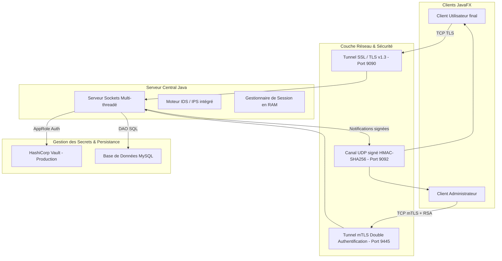
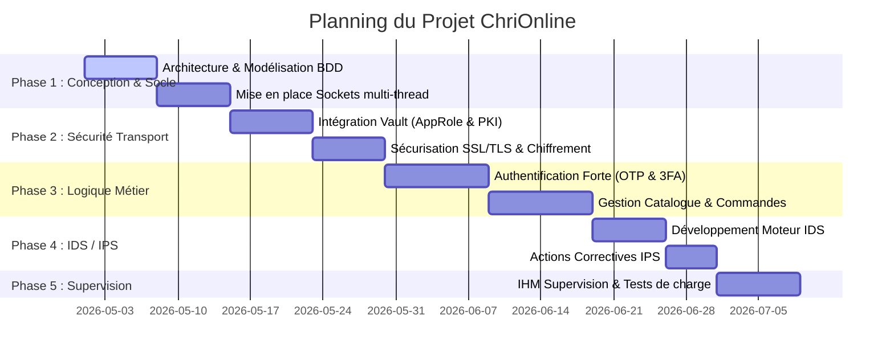

# 📋 Plan Directeur de Conception et d'Implémentation - ChriOnline

Ce document présente la planification globale, les choix architecturaux et la stratégie de sécurisation industrielle de l'application e-commerce distribuée **ChriOnline**. Ce plan couvre l'ensemble du cycle de développement, de la phase de conception initiale jusqu'aux mécanismes de défense active (IDS/IPS).

---

## 🏛️ 1. Architecture Globale du Projet

L'application ChriOnline repose sur une **architecture distribuée 3-Tiers** conçue pour assurer la séparation des responsabilités, la modularité et la sécurité des données.



### Description des Livrables du Projet :
1.  **Livrable Client Standard (`client.jar`) :** Interface JavaFX permettant aux clients de s'inscrire, de s'authentifier (2FA), de parcourir le catalogue, de gérer leur wishlist, leur panier et de finaliser des commandes avec chiffrement applicatif de leurs données de paiement.
2.  **Livrable Client Admin (`admin.jar`) :** Interface d'administration JavaFX isolée et renforcée nécessitant une authentification à 3 facteurs (3FA : mot de passe + signature RSA de défi + OTP) et une connexion réseau exclusive via mTLS.
3.  **Livrable Serveur Central (`server.jar`) :** Moteur applicatif Java s'exécutant en tâche de fond, gérant les sockets de communication, appliquant les règles métiers, hébergeant l'IDS/IPS et interagissant avec MySQL et HashiCorp Vault.

---

## 🛠️ 2. Choix Techniques Argumentés

| Composant | Technologie Sélectionnée | Justification Technique |
| :--- | :--- | :--- |
| **Interface Graphique** | **JavaFX (OpenJFX 17+)** | Permet de concevoir des interfaces riches, modulaires (architecture FXML/MVC) et bénéficie d'une accélération matérielle native supérieure à Swing. |
| **Serveur Central** | **Java SE (JDK 17+)** | Fournit un environnement multi-thread robuste pour la gestion des connexions socket concurrentes. L'utilisation du JDK 17 garantit le support des derniers protocoles TLS et de l'API de cryptographie standard (JSSE). |
| **Réseau (TCP)** | **Sockets TCP SSL/TLS (JSSE)** | Sécurise le transport des données en assurant la confidentialité et l'intégrité de bout en bout, éliminant les écoutes réseau passives (reniflage/MITM). |
| **Réseau (UDP)** | **Datagram Sockets signés par HMAC** | Utilisé pour pousser les notifications asynchrones (alertes de stock, nouvelles commandes) sans la surcharge de TCP, tout en protégeant les paquets contre l'injection grâce à une signature HMAC-SHA256. |
| **Gestion des Secrets** | **HashiCorp Vault** | Évite le stockage de secrets en dur. Gère dynamiquement les clés de chiffrement applicatif (Transit), génère les certificats SSL éphémères (PKI) et stocke les clés publiques des administrateurs. |
| **Base de Données** | **MySQL (avec Docker Compose)** | Base relationnelle performante pour la gestion des transactions e-commerce (produits, utilisateurs, commandes, blacklistes de sécurité). |

---

## 📅 3. Planification du Projet par Phases



### 📋 Description Détaillée des Phases :

#### Phase 1 : Conception et Architecture du Socle Réseau
*   **Étape 1 (Conception) :** Modélisation de la base de données relationnelle (schémas SQL pour les tables `utilisateur`, `client`, `admin`, `commande`, `security_blacklist`). Conception du protocole d'échange de messages sous forme de structures sérialisées `Map<String, Object>`.
*   **Étape 2 (Réseau de base) :** Implémentation du serveur TCP multi-threadé (`Server.java` et `ClientHandler.java`) gérant l'aiguillage des requêtes et du client de communication (`Client.java`).

#### Phase 2 : Sécurisation du Transport et des Données Sensibles (Mini-Projet 2)
*   **Étape 3 (Infrastructure de secrets) :** Déploiement de HashiCorp Vault via Docker. Configuration des moteurs AppRole, KV (Key-Value) et PKI pour les certificats SSL.
*   **Étape 4 (Sécurité réseau) :** Remplacement des sockets TCP bruts par des sockets SSL/TLS sécurisés. Intégration de la validation stricte du certificat serveur par le client à l'aide d'un TrustStore contenant l'autorité racine de Vault (`vault-ca.pem`).
*   **Étape 5 (Chiffrement applicatif) :** Implémentation de la classe cryptographique `PaymentCrypto.java` (AES-256/GCM) pour chiffrer les données bancaires côté client avant de les transmettre et de les stocker.

#### Phase 3 : Logique Métier E-Commerce & Authentification Forte
*   **Étape 6 (Authentification & OTP) :** Création des parcours d'inscription et de connexion. Intégration du deuxième facteur d'authentification (2FA OTP) pour les clients standards.
*   **Étape 7 (Authentification Admin 3FA) :** Implémentation de la connexion administrateur à 3 facteurs :
    1.  Vérification du mot de passe haché avec BCrypt.
    2.  Défi cryptographique RSA (signature asymétrique `SHA256withRSA`).
    3.  Validation du code temporel TOTP (RFC 6238).
*   **Étape 8 (Fonctionnalités Métier) :** Gestion du catalogue de produits, gestion des paniers d'achat, validation de commande, et génération de factures PDF via iText. Implémentation des notifications UDP signées HMAC.

#### Phase 4 : Conception et Développement de l'IDS / IPS (Mini-Projet 3)
*   **Étape 9 (Moteur IDS) :** Développement d'un analyseur d'événements comportementaux en temps réel. Écriture des règles de corrélation pour identifier les attaques (Brute Force, OTP suspect, usurpation IP Spoofing, Flood de requêtes).
*   **Étape 10 (Réactions IPS) :** Conception des contre-mesures automatisées (blocage d'IP temporaire ou définitif en base de données, suspension de compte utilisateur, invalidation de session suspecte, fermeture de socket TCP).

#### Phase 5 : Interface de Supervision & Validation
*   **Étape 11 (Supervision graphique) :** Développement de la vue graphique `SecurityDashboardView.java` côté administrateur pour lister en temps réel les alertes de sécurité, auditer les logs et permettre le déblocage manuel des IPs d'un simple clic.
*   **Étape 12 (Tests d'intrusion et validation) :** Simulation d'attaques par force brute, de tentatives d'IP Spoofing, et de flood réseau pour valider les réactions automatiques de l'IDS/IPS.

---

## 🛡️ 4. Section Dédiée à la Sécurité & Défense Active

Pour protéger cette architecture e-commerce distribuée contre les attaques modernes, plusieurs couches de défense proactives ont été déployées :

```
[Flux Client] 
   │
   ├──► 1. Limiteur de Connexions TCP (ConnectionSecurityManager) ──► Rejet si > 100 conn/min (SYN Flood / DDoS)
   │
   ├──► 2. Intercepteur de Paquets (SecurityInterceptor) ──► Analyse IP Spoofing & Blacklist BDD
   │
   ├──► 3. Limiteur Applicatif (Rate Limiting) ──► Rate-limiting fin par client
   │
   ├──► 4. Moteur de Détection (SecurityLogger IDS) ──► Analyse Brute Force / OTP / Admin suspect
   │
   └──► [Traitement Applicatif]
```

### 1. Protection contre le Brute-Force & Verrouillage de Comptes
*   **Mécanisme :** Le serveur suit le nombre de tentatives de connexion échouées par utilisateur dans la base de données.
*   **Contre-mesure IPS (Palier Temporel) :** Le compte est verrouillé avec une durée de blocage progressive :
    *   3 échecs : blocage de 1 minute.
    *   6 échecs : blocage de 15 minutes + ajout automatique de l'IP du client sur liste noire temporaire.
    *   9 échecs : blocage de 1 heure.
    *   12 échecs : blocage de 24 heures.

### 2. Protection contre le DDoS & SYN Flood
*   **Mécanisme :** Au niveau le plus bas de l'acceptation des sockets TCP, la classe `ConnectionSecurityManager.java` enregistre chaque adresse IP cliente effectuant une poignée de main TCP.
*   **Contre-mesure IPS :** Si une adresse IP effectue plus de **100 connexions par minute**, elle est identifiée comme menant une attaque SYN Flood ou DoS. L'IPS la bannit automatiquement et temporairement pour une durée de 5 minutes, libérant immédiatement les ressources threads du serveur.

### 3. Limitation Fine de Requêtes (Rate Limiting Applicatif)
*   **Mécanisme :** Au-delà du taux de connexions TCP brutes, le serveur limite le débit des requêtes métiers (comme l'ajout frénétique d'articles au panier ou le parcours automatisé des fiches produits).
*   **Implémentation recommandée :** Utilisation de la bibliothèque **Bucket4j** (basée sur l'algorithme Token Bucket). Chaque session client dispose d'un panier virtuel de jetons. Chaque commande consomme un jeton. Si le panier est vide, le serveur retourne un code d'erreur `429 Too Many Requests` (ou son équivalent de protocole Map) sans surcharger la base de données.

### 4. Détection de l'IP Spoofing (Usurpation d'Adresse IP)
*   **Mécanisme :** `SecurityInterceptor.java` analyse l'IP réelle du socket de transport TCP établie par le système d'exploitation et la compare à l'IP revendiquée dans les en-têtes applicatifs de la requête client (`claimedIp`).
*   **Contre-mesure IPS (Auto-Ban) :** Si une IP publique tente de revendiquer une adresse IP locale ou privée (ex: `192.168.x.x` ou `10.x.x.x`), le serveur intercepte l'usurpation, lève une alerte critique `IP_SPOOFING`, et procède à un **bannissement permanent** (10 ans) immédiat de l'adresse IP dans la table `security_blacklist`.

### 5. Durcissement des Sessions TCP (Session Hijacking Prevention)
*   **Mécanisme :** Les sessions utilisateur ne sont pas statiques.
*   **Contre-mesures :**
    1.  **Session IP Binding :** Chaque session ouverte est liée de manière rigide à l'adresse IP source ayant initié la connexion. Si un attaquant vole le jeton de session (JWT) et tente de l'utiliser depuis une autre IP, la session est immédiatement révoquée.
    2.  **Rolling Session IDs :** Après chaque transaction critique (validation de commande, modification de profil), le jeton de session est détruit et régénéré de manière transparente. Cela réduit à néant l'espérance de vie d'un jeton dérobé.

---

## 💡 5. Bonnes Pratiques Modernes vs Pratiques Obsolètes

Dans le cadre de la transition vers une architecture sécurisée de niveau bancaire, plusieurs pratiques courantes mais obsolètes ont été identifiées et remplacées par des alternatives modernes :

| Pratique Obsolète / Vulnérable | Risque Associé | Alternative Moderne (Implémentée dans ChriOnline) | Justification Sécurité |
| :--- | :--- | :--- | :--- |
| **Clés cryptographiques codées en dur** dans le code source (`String key = "mon_secret"`). | Fuite de clé par ingénierie inverse (décompilation du JAR client) ou fuite de dépôt Git. | **Gestion dynamique via HashiCorp Vault AppRole.** | Les clés de chiffrement et mots de passe ne résident jamais sur le disque ou dans le code. Ils sont injectés dynamiquement en mémoire RAM au démarrage depuis un coffre-fort hautement sécurisé. |
| **Simulation de protocole HTTPS personnalisé** au niveau applicatif (chiffrement manuel RSA/AES sur sockets bruts). | Sujet aux attaques de l'homme du milieu (MITM), aux faiblesses d'entropie et d'implémentation de protocole. | **Implémentation native de Sockets TLS v1.3 (JSSE)** avec vérification stricte du certificat via un TrustStore. | Utilise les standards de l'industrie testés et validés. L'authentification mutuelle (mTLS) garantit que seuls les clients autorisés avec un certificat valide peuvent contacter le port admin. |
| **Chiffrement AES en mode CBC** avec un IV (Vecteur d'Initialisation) fixe ou prévisible. | Vulnérabilité aux attaques par oracle de padding (Padding Oracle Attacks) et possibilité de décoder des blocs identiques. | **Chiffrement AES-256 en mode GCM** avec IV unique de 12 octets (`SecureRandom`) pour chaque opération. | Le mode GCM offre un chiffrement authentifié (AEAD). Il garantit non seulement la confidentialité mais aussi l'**intégrité** absolue des données bancaires grâce à son tag d'authentification de 128 bits. |
| **Stockage des mots de passe en MD5 ou SHA-256** simple. | Vulnérabilité extrême aux attaques par table de correspondance (Rainbow Tables) et attaques par force brute ultra-rapides sur GPU. | **Hachage salé adaptatif via BCrypt** (bibliothèque `jbcrypt`). | BCrypt intègre un facteur de travail (work factor) ralentissant volontairement l'algorithme pour rendre le cracking par force brute irréalisable, et génère un sel aléatoire unique pour chaque utilisateur. |
| **Fichiers de logs textuels plats** et verbeux stockés sans protection. | Un intrus ayant compromis le serveur peut lire les données sensibles ou effacer ses traces de logs pour masquer ses méfaits. | **Logs structurés via Log4j2** avec **Chiffrement AES-GCM** des logs d'audit sensibles. | Les événements de sécurité sont envoyés dans un canal distinct `security_audit.log` à accès restreint. Les données sensibles y sont masquées ou chiffrées pour respecter le RGPD et empêcher la falsification des traces d'audit. |
